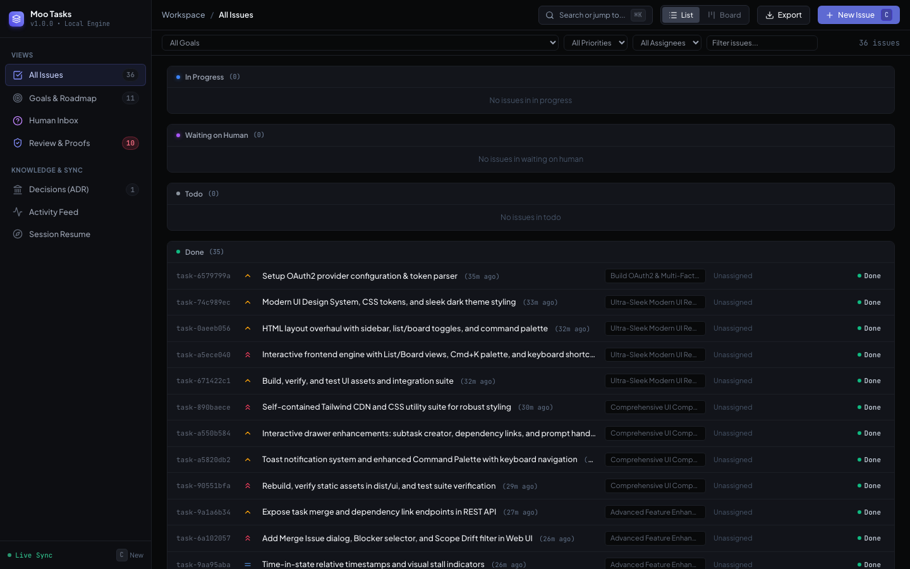

<div align="center">


# 🐮 Moo Tasks

[](https://github.com/shekarsiri/moo-tasks/actions)
[](https://opensource.org/licenses/MIT)
[](https://nodejs.org)
[](https://modelcontextprotocol.io)

**Agentic Task Orchestration & Management Engine** built for AI coding agents (**Claude Code**, **Cursor**, **Windsurf**, **Antigravity**, **Copilot**) and human-in-the-loop pair programming.

[Quick Start](#-quick-start) • [Agent Setup](#-agent--mcp-setup) • [Agent Protocol](#-mandatory-agent-protocol) • [Architecture](#%EF%B8%8F-architecture) • [MCP Tools](#%EF%B8%8F-mcp-tool-reference)

<br/>



</div>

---

## 🌟 Why Moo Tasks?

Standard AI coding agents often suffer from:
1. **Scope Drift**: Wandering away from original user intent into endless low-value refactorings.
2. **Over-Planning**: Generating 40 shallow tasks without executing any of them.
3. **Looping / Thrashing**: Attempting the same failed fix repeatedly without stopping.
4. **Unverifiable Work**: Claiming code is complete without running tests or producing evidence.
5. **Re-Debating Decisions**: Re-arguing settled architectural choices on every context reset.

**Moo Tasks** solves this by providing a local SQLite engine (WAL mode), a rich real-time Web UI, and a Model Context Protocol (MCP) server that enforces strict enterprise invariants at runtime.

---

## ✨ Key Capabilities & Feature Matrix

### 🎯 1. Goals & Scope Control
- **Verbatim Human Prompts**: Sits above tasks, preserving the exact original user request.
- **Goal Coverage & Loose Ends**: Live metrics on task completion percentage and lingering open tasks.
- **Scope Drift Detection**: Automatically identifies and flags orphan tasks with no linked goal.
- **Goal Open Caps**: Hard cap on maximum open tasks per goal (default: 10), preventing agents from over-planning.
- **Cascade Operations**: Atomically drop, kill, or reopen all tasks under a goal with mandatory reasons.

### 📋 2. Task Lifecycle & DAG Dependencies
- **Subtask Nesting Constraint**: Exactly 1 level of subtasks under a parent task.
- **Finite State Machine**: `todo`, `doing`, `blocked-on-dependency`, `waiting-on-human`, `done`, `dropped`.
- **DAG Dependency Graph**: Automatic cycle detection and automatic unblocking of downstream tasks.
- **Parent Closure Guard**: Prevents closing parent tasks while any subtask remains open.
- **Status Undo & History**: Roll back accidental state transitions from the web board, using full transition audit history.

### 🛡️ 3. Completion, Verification & Proof of Work
- **Acceptance Criteria**: Mandatory criteria written in Markdown *before* work starts.
- **Evidence Requirement**: Closing a task requires verifiable proof (commands run, stdout output, test proofs).
- **Two-Phase Verification**: Distinguishes `agent_completed` from human `verified_done`.
- **Rejection with Reason**: Humans can reject completed work from the web board with feedback; the task returns to the queue unclaimed (`todo`, or `blocked-on-dependency` while its blockers are open) and increments the reopen counter.

### 🙋 4. Human Collaboration & Blocking
- **Waiting-on-Human Queue**: Agents pause blockers with attached questions (`clarification`, `approval`, `credential`, `decision`).
- **Reactive Resume**: Answering a question in the web board automatically transitions the task back into the ready queue without agent restarts.
- **Dedicated Human Inbox**: Real-time queue of everything needing human attention.

### 🔍 5. Discovered Work
- **Mid-Task Work Capture**: Capture new work found mid-flight without relinquishing current task claim.
- **Must-Fix vs Deferred**: Mark as `must-fix-now` (inserted as blocker) or `deferred` (backlog pile).

### 🤖 6. Ownership, Concurrency & Leases
- **Exclusive Task Claims**: 30-minute leases, renewed whenever the agent calls a tool with the task's `taskId`; claims held by a dead agent process are released.
- **Checkpoints**: `moo_checkpoint` logs progress and renews the lease during long-running tasks.
- **Agent Concurrency Limits**: Cap simultaneous tasks held per agent (default: 1).
- **File Touch Conflict Warnings**: Declared files are checked for overlaps against other active claims.

### 🔄 7. Stall & Thrash Detection
- **Attempt Counter**: Incremented on each claim/attempt.
- **Auto-Escalation**: After $N$ attempts (default: 3), automatically pauses task to `waiting-on-human` instead of endless looping.
- **Time-in-State Tracking**: Audits time spent in `doing` and detects repeated reopens.

### 🏛️ 8. Settled Architectural Decisions (ADR)
- **Project-Level Record**: Preserves choices and rationales that outlive tasks.
- **Pre-Planning Consultation**: Agents read settled decisions before planning.
- **Supersede Support**: Cleanly update and link superseded decisions with mandatory reasons.

---

## 🚀 Quick Start & Installation

### Option A: Install Globally (Recommended for `moo` command)
Install `moo-tasks` globally to access the short `moo` command anywhere:
```bash
npm install -g moo-tasks
# or: pnpm add -g moo-tasks | bun add -g moo-tasks
```
Once installed, you can use `moo` directly:
```bash
moo init           # Register this repo as a workspace & write agent rule files
moo install claude # Configure an agent's MCP server (add --hooks for Claude Code)
moo start          # Launch real-time Web UI (http://127.0.0.1:4242)
moo ws             # List registered global workspaces
moo status         # Show Where-Did-I-Leave-Off context
moo search <query> # Full-text SQLite search
```
Other commands: `moo list`, `moo next`, `moo run <prompt>`, `moo import <file>`, `moo export`, `moo ws:add|ws:rename|ws:remote|ws:remove`. Run `moo --help` for details.

> 💡 **Note on `moo` vs `npx`**:
> - Bare `moo <command>` works when installed globally via `npm install -g moo-tasks`.
> - If running without global installation, use `npx moo-tasks <command>` (do **not** use `npx moo`, as `moo` on npm registry is an unrelated package).
> - If `moo: command not found` appears after global install, ensure npm's global bin directory is in your `$PATH`:
>   ```bash
>   export PATH="$(npm prefix -g)/bin:$PATH"
>   ```

---

### Option B: On-Demand via `npx moo-tasks`
Run directly without global installation:

#### 1. Initialize Workspace & Agent Protocols
Run in your project root:
```bash
npx moo-tasks init
```
This:
- Registers the project as a workspace in the global SQLite database (`~/.moo/tasks.db`, WAL mode; override with `MOO_HOME` or `MOO_DB_PATH`).
- Writes (or refreshes) a managed Moo protocol block in `AGENTS.md`, `CLAUDE.md` (which imports `@AGENTS.md`), `.cursor/rules/moo-tasks.mdc`, and `.windsurf/rules/moo-tasks.md`. Text outside the block is left untouched; legacy `.cursorrules` / `.windsurfrules` are refreshed only if they already exist.

#### 2. Web Board
The MCP server starts the web board automatically in the background, so once an agent is connected it is available at **`http://localhost:4242`** (one board is shared by every agent on the machine). Set `MOO_NO_UI=1` to disable auto-start, or `MOO_PORT` to change the port.

To run it manually:
```bash
npx moo-tasks start
```

To access the Web UI from another device or tablet on your local network (LAN):
```bash
npx moo-tasks start --lan
# Automatically logs: http://192.168.x.x:4242/
```

---

## 🔌 Agent & MCP Setup

### One-Command Multi-Agent Installer
```bash
# Configure all detected agent IDEs at once:
npx moo-tasks install all

# Or configure specific clients:
npx moo-tasks install claude       # Updates ~/.claude.json
npx moo-tasks install cursor       # Generates .cursor/mcp.json
npx moo-tasks install windsurf     # Updates ~/.codeium/windsurf/mcp_config.json
npx moo-tasks install antigravity  # Generates .gemini/settings.json
npx moo-tasks install codex        # Prints a generic MCP config snippet
```

### Claude Code Hooks (optional)
```bash
npx moo-tasks install claude --hooks                # project: .claude/settings.json
npx moo-tasks install claude --hooks --scope user   # user: ~/.claude/settings.json
```
This adds `SessionStart`, `PreToolUse` and `PostToolUse` hooks that run `moo hook <session-start|pre-edit|post-edit>`:
- **session-start** injects the Where-Did-I-Leave-Off context.
- **pre-edit** blocks `Edit` / `Write` / `MultiEdit` / `NotebookEdit` on files inside the workspace when this session holds no claimed task in the workspace.
- **post-edit** renews the claim's lease.

Re-running the installer replaces earlier Moo hooks and leaves other hooks alone. Projects that never ran `moo init` are ignored; set `MOO_HOOKS=off` to disable the hooks temporarily.

### Manual Configuration
```json
{
  "mcpServers": {
    "moo-tasks": {
      "command": "npx",
      "args": ["-y", "moo-tasks", "mcp"]
    }
  }
}
```

---

## 🤖 Mandatory Agent Protocol

`moo init` writes this protocol into `AGENTS.md` (and the other agent rule files):

```
1. SESSION RESUME → moo_session_resume() at session start
2. CLAIM FIRST    → Before the first edit, hold a claimed task:
                    moo_quick_start(title, acceptanceCriteria, description, declaredFiles) for new work,
                    or moo_get_next_task(claim: true) for planned work.
                    Small change already done? moo_log_work(title, evidence).
3. LARGER WORK    → moo_create_goal(title, verbatimPrompt, description), then
                    moo_create_task(goalId, tasks: [...]) with criteria, declaredFiles, dependsOnTaskIds
4. WHILE WORKING  → moo_checkpoint (renews the 30-min lease), moo_capture_discovered_work,
                    moo_ask_human, moo_log_attempt_failure, moo_record_decision
5. FINISH         → moo_complete_task(taskId, evidence: { testProof or outputSnippet, commandsRun })
```

Reading, searching and read-only commands never need a task. Parallel sub-agents each pass their own `agentId`.

---

## 🛠️ MCP Tool Reference

| Tool Name | Purpose |
|---|---|
| `moo_create_goal` | Anchor a request as a goal: verbatim prompt plus Markdown PRD (caps open tasks, default 10) |
| `moo_get_goal` | Goal spec, progress metrics and loose ends; optionally lists its tasks |
| `moo_update_goal` | Edit a goal; `dropped` (with reason) drops its open tasks, `active` reopens it |
| `moo_list_goals` | List this workspace's goals |
| `moo_create_task` | Create one task, or many via `tasks[]` (all-or-nothing); `claim=true` also claims it |
| `moo_quick_start` | ⚡ Create and claim a task in one call; `goalId` optional |
| `moo_log_work` | Record small, already-finished work as a completed task in one call |
| `moo_update_task` | Edit task fields and dependencies (`addDependsOn` / `removeDependsOn`) |
| `moo_get_task` | Full task with dependencies, subtasks and notes |
| `moo_list_tasks` | Filterable task summaries in this workspace |
| `moo_get_next_task` | Highest-priority unblocked todo task; `claim=true` claims it |
| `moo_claim_task` | Claim a task exclusively (30-min lease, renewed on any tool call with its `taskId`) |
| `moo_checkpoint` | ⚡ Log a progress note on your claimed task and renew its lease |
| `moo_release_task` | Give up your claim; the task returns to the queue |
| `moo_handoff_task` | Transfer your claim to another agent with a summary |
| `moo_complete_task` | Complete your claimed task with evidence; `autoClaimNext` claims the next ready task |
| `moo_log_attempt_failure` | Record a failed attempt; repeated failures escalate to a human |
| `moo_drop_task` | Drop one or several tasks with a reason |
| `moo_reopen_task` | Reopen one or several tasks |
| `moo_ask_human` | Pause a task on a question for the user (clarification, approval, credential, decision) |
| `moo_add_task_note` | Attach a note to a task |
| `moo_capture_discovered_work` | Record work found mid-task (must-fix-now blocks the current task, otherwise deferred) |
| `moo_record_decision` | Record an architectural decision; `supersedesDecisionId` replaces an older one |
| `moo_list_decisions` | This workspace's decisions |
| `moo_session_resume` | Where you left off: claimed task, ready work, waiting-on-human, decisions, stall warnings |
| `moo_get_file_context` | Before editing: who holds the files now, plus past tasks, decisions and notes about them |
| `moo_search` | Full-text search over tasks and decisions in this workspace |

**Board-only actions**: verifying completed work, answering human questions, rejecting a completed task, undoing a status change, and deleting a workspace are done by humans in the web board, not by agents.

> Older tool names from earlier releases (e.g. `moo_create_tasks_batch`, `moo_heartbeat_task`) are still accepted as hidden aliases for compatibility, but are no longer listed.

---

## 🏛️ Architecture & Clean Code

```
src/
├── domain/                    # Pure Enterprise Domain Rules & Invariants
│   ├── types.ts              # Domain interfaces & value types
│   ├── errors.ts             # Domain-specific typed error classes
│   ├── dependency.ts         # DAG cycle detector & unblocked evaluator
│   ├── conflict.ts           # File touch overlap conflict detector
│   └── similarity.ts         # Duplicate task similarity detector
│
├── infrastructure/            # Persistence & External Integrations
│   ├── db/database.ts        # SQLite manager (WAL mode, busy timeout)
│   ├── db/migrations.ts      # Schema DDL and versioning
│   ├── git/git-context.ts    # Git branch, commit, dirty status extractor
│   ├── web/web-ui.ts         # Web board auto-start (shared, one per machine)
│   └── repositories/         # SQLite Repository Implementations
│
├── services/                  # Application Services (Use Cases)
│   ├── goal-service.ts        # Goal lifecycle & cap enforcement
│   ├── task-lifecycle-service.ts # State machine, ready queue, undo
│   ├── claim-service.ts       # Exclusive claims, leases, dead-agent timeout
│   ├── verification-service.ts# Proof of work & two-phase verification
│   ├── human-collab-service.ts# Human Q&A queue & reactive resume
│   ├── discovered-work-service.ts # Mid-flight discovered work
│   ├── decision-service.ts    # ADR logs & supersede linking
│   ├── duplicate-merge-service.ts # Idempotency & task merging
│   ├── session-service.ts     # Where-did-I-leave-off session resume
│   ├── housekeeping-service.ts# Archiving & multi-format export
│   ├── markdown-import-service.ts # PRD / checklist import into goals & tasks
│   ├── search-service.ts      # FTS5 full-text search
│   ├── workspace-service.ts   # Global workspace registry
│   └── index.ts               # Dependency Injection Container
│
├── mcp/                       # Model Context Protocol Stdio Server
├── server/                    # Fastify HTTP + Server-Sent Events (SSE) Engine
├── cli/                       # CLI Commands (init, install, hook, start, mcp, ws, status, ...)
└── ui/                        # Vanilla JS + Tailwind + Lucide Icons Web UI
```

---

## 🤝 Contributing

Contributions are welcome! Please check out [CONTRIBUTING.md](./CONTRIBUTING.md) for development setup, testing, and PR guidelines.

---

## 📄 License

This project is licensed under the [MIT License](./LICENSE).
